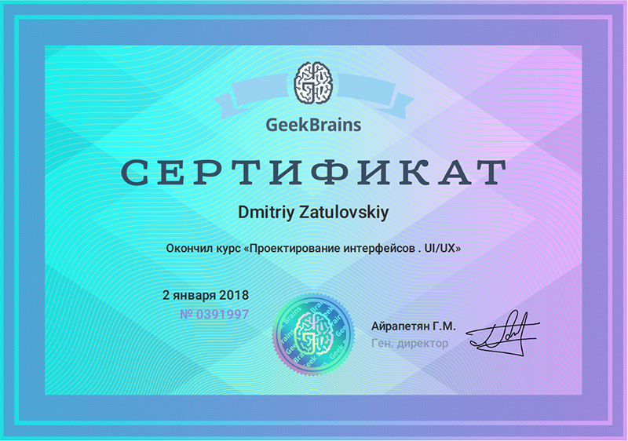
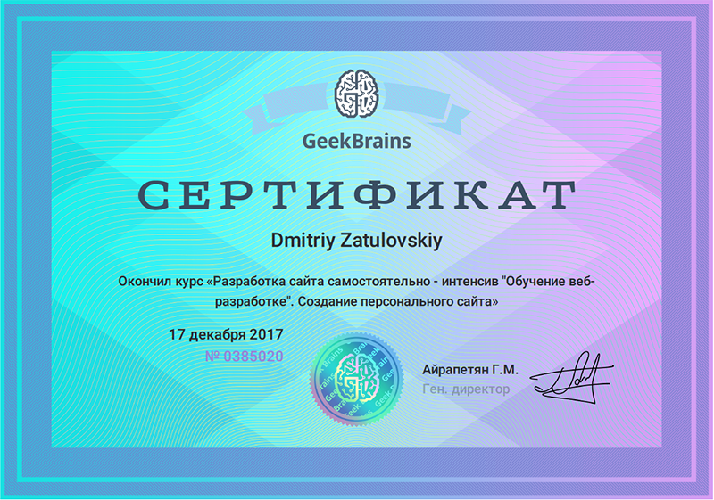
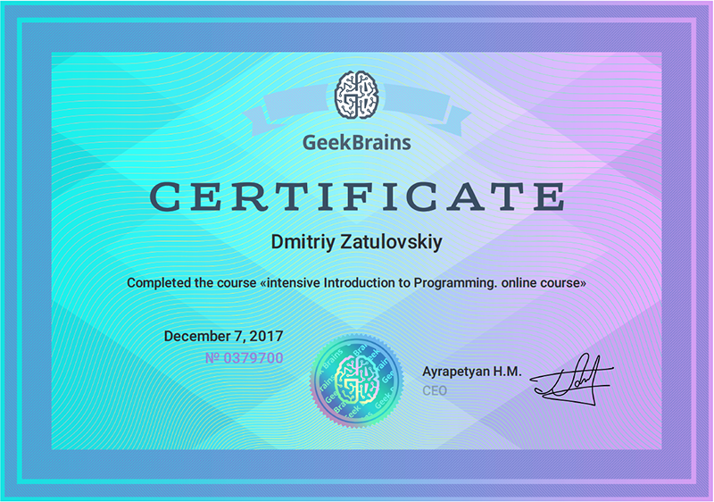
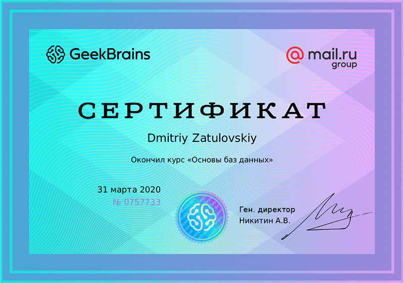

# Сertificates

## [Udacity]

1.) Certificate Nanodegree Program - [Front End Web Developer]  

2.) Certificate Nanodegree Program - <a href="./pdf/Certificate Udacity Two Android.pdf" target="_blank">Android Development Track</a>  

3.) Certificate Nanodegree Program - <a href="./pdf/Certificate Udacity Two FrontEnd.pdf" target="_blank">Front End Development Track</a>  

4.) Certificate Nanodegree Program - <a href="./pdf/Certificate Udacity Two FullStack.pdf" target="_blank">Full Stack Development Track</a>  

## [GeekBrains]

1.) Certificate - <a href="./pdf/GeekBrains_2440194_391997.ru.pdf" target="_blank">Design the user interface . UI/UX</a>  

2.) Certificate - <a href="./pdf/GeekBrains_2440194_385020.ru.pdf" target="_blank">Website development on your own-intensive Web Development Training. Creating a personal website</a>  

3.) Certificate - <a href="./pdf/GeekBrains_2440194_379700.en.pdf" target="_blank">Intensive Introduction to Programming. Online course</a>  

4.) Certificate - <a href="./pdf/GeekBrains_Fundamentals_of_database.pdf" target="_blank">Fundamentals of database</a>  

[udacity]: https://www.udacity.com/
[geekbrains]: https://geekbrains.ru/
[front end web developer]: https://confirm.udacity.com/7QM9HD6

© 2021
